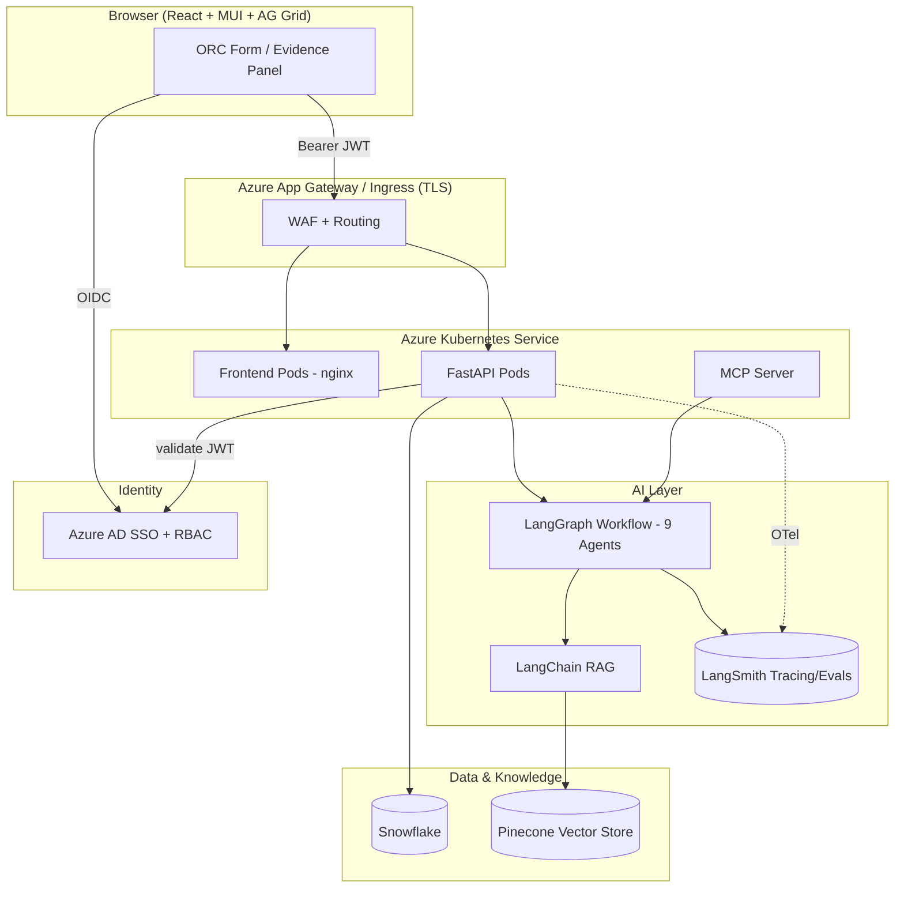
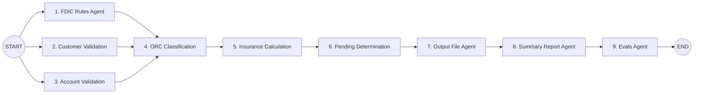
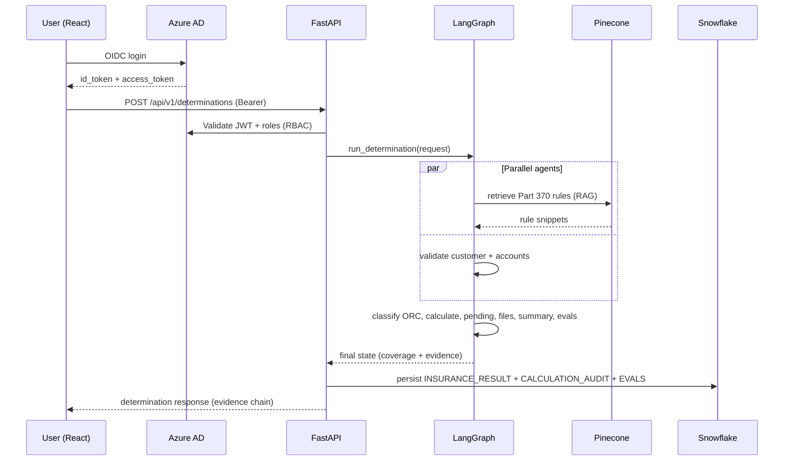
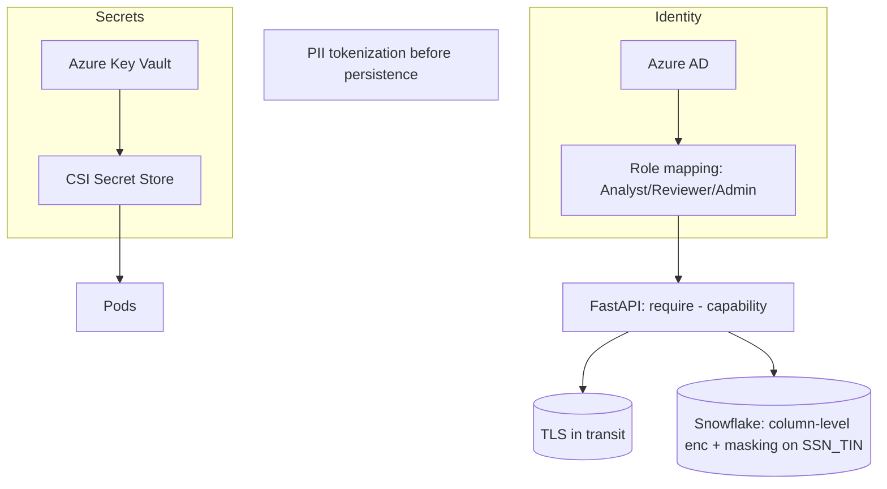
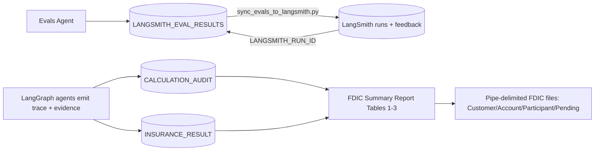

# FDIC Part 370 Platform — Architecture

> Diagrams use Mermaid. View on GitHub or any Mermaid-aware Markdown renderer.

## 1. End-to-End Architecture



## 2. LangGraph Multi-Agent Workflow



The three entry agents run **in parallel**; LangGraph's reducer-annotated state
merges their outputs before classification. The remainder is a linear pipeline.

## 3. Sequence — Determination Request



## 4. Sequence — Iterative Recalculation (Alternative Recordkeeping)

```mermaid
sequenceDiagram
  participant Svc as Recordkeeping Source
  participant F as FastAPI
  participant G as LangGraph
  participant S as Snowflake

  Note over F: Initial run left accounts in Pending (AR* reason codes)
  Svc->>F: POST /determinations/{id}/recalculate (updated accounts)
  F->>G: run_determination(alt_recordkeeping_received=true)
  G->>G: Pending Agent clears AR* reasons; engine recomputes
  G-->>F: revised coverage + cleared pending
  F->>S: persist recalc (IS_RECALC=true)
```

## 5. Security Architecture



**Controls**
- Azure AD SSO (OIDC); JWT signature + issuer + audience verified per request.
- RBAC capability matrix in `core/auth.py` (`run_determination`, `view_audit`, `seed_rag`).
- Secrets via Azure Key Vault + CSI driver (never in images/env files in prod).
- SSN/TIN tokenized/encrypted; Snowflake dynamic data masking on `SSN_TIN`.
- TLS everywhere; WAF at App Gateway; non-root containers; network policies.
- Full immutable audit trail in `CALCULATION_AUDIT` (VARIANT evidence payload).

## 6. Audit & Compliance Architecture



Every determination produces: (a) a reproducible evidence chain per ORC,
(b) reconciliation evals (insured + uninsured = PI), and (c) the four FDIC
output files plus the 3-table Summary Report — all persisted and queryable.

**Eval flow.** The in-workflow Evals Agent writes one row per check to
`LANGSMITH_EVAL_RESULTS` on every determination. `sync_evals_to_langsmith.py`
then pushes those rows to LangSmith as **runs + feedback** (PASS=1 / WARNING=0.5 /
FAIL=0) and writes the `LANGSMITH_RUN_ID` back, linking each Snowflake eval row to
its LangSmith run. The separate **offline experiment**
(`seed_langsmith_dataset.py --run`) scores the labeled per-ORC dataset with the 6
named evaluators and lives only in the LangSmith UI.
```
